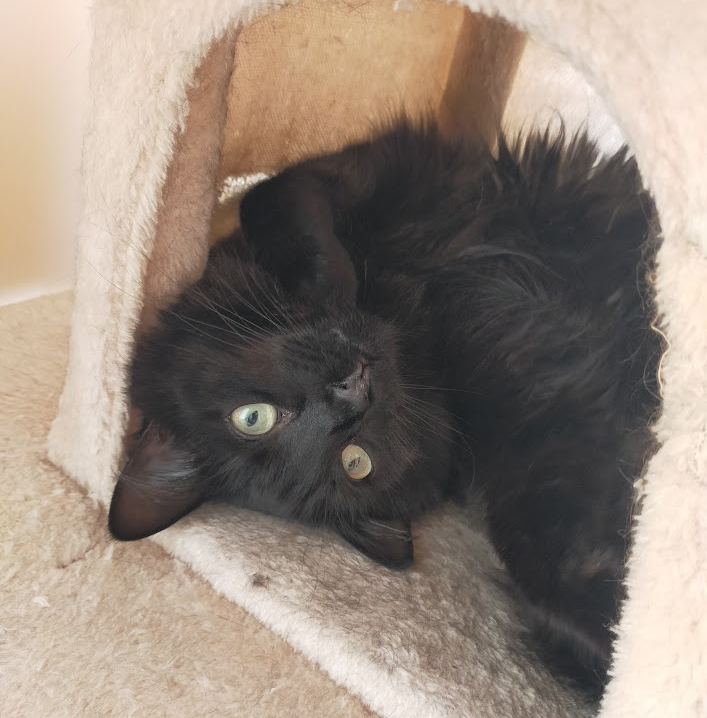

## Profile
- 👋 Hi, I’m Zachary J. Hobbs
- 👀 I’m interested in the areas of: digital VLSI, analog control systems, DSP, and RF.
- 🌱 I’m currently: pursuing a BE(Hons) in Electrical and Electronic Engineering
- 💞️ I’m looking to collaborate on: research or random projects.
- 📫 How to reach me is: directly via FM on VHF or UHF bands, or just my email address that you likely have.

Just some random undegraduate.

> [!TIP]
> **Tip:** Feature cat photographs in your schematics to enhance readability.
> 

<!-- Redundant information.
## Languages:
#### Proficient:
C#, Java, C++, 8051 Assembly, 8051 embedded C, MATLAB
Python, HTML, CSS, JS, GDScript
#### Learning:
VHDL, SystemVerilog
-->